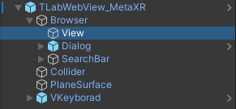

# TLabWebViewVR-OculusIntegration-2022

## Overview
This sample Unity project is the minimum configuration for using [```TLabWebView```](https://github.com/TLabAltoh/TLabWebView) (3D web browser / 3D WebView plugin) with the [```MetaXR SDK```](https://developers.meta.com/horizon/downloads/package/meta-xr-sdk-all-in-one-upm). This includes searchbar example and javascript event (text area focus/focusout) example to toggle virtual keyboard visibility.

[Document is here](https://tlabgames.gitbook.io/tlabwebview)  
[Snippets is here](https://gist.github.com/TLabAltoh/e0512b3367c25d3e1ec28ddbe95da497#file-tlabwebview-snippets-md)

> [!WARNING]
> Note that this project only works on Android devices; it will not display web pages when run on the Unity Editor.

> [!WARNING]
> Meta XR All-in-One SDK is having a reference error at version 74 (Please see [this forum](https://www.reddit.com/r/oculusdev/comments/1jn4l5k/error_implementing_meta_allinone_sdk/)), so I will keep version 72 for now.

> [!WARNING]
> For now, I do not recommend building this project with Unity 6000.x due to unstable. If you do, please refer to the "Configuration for Unity 6000.x" section in the [Setup section](https://github.com/TLabAltoh/TLabWebView?tab=readme-ov-file#set-up).

> [!WARNING]
> This project uses `HardwareBuffer` as the default `CaptureMode` for WebView. This `HardwareBuffer` option is confirmed to work with Oculus Quest, but may not work with some other devices (e.g., the WebView screen may go blank). In that case, change the `CaptureMode` from `HardwareBuffer` to `ByteBuffer`.
>
> <details>
> </img><br>
> </img>
> </details>

## Getting Started

### Requirements
- Unity Editor: 2022.3.19f1

### Installing
Clone the repository with the following command

```
git clone https://github.com/TLabAltoh/TLabWebViewVR-OculusIntegration-2022.git

cd TLabWebViewVR-OculusIntegration-2022

git submodule update --init
```

### Set up
Please see the setup section [here](https://github.com/TLabAltoh/TLabWebView?tab=readme-ov-file#set-up)

<details><summary>When using the OpenXR plugin</summary>

Please disable `Force Remove Internet Permission` from XR Plugin Manegement

</img>

</details>